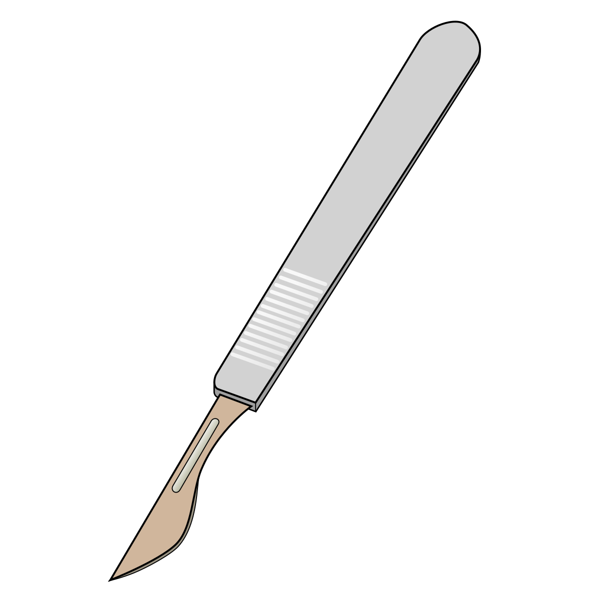

SCALPEL: single-cell APA characterization
=========================================

About The Project
-----------------

**SCALPEL** is a NextFlow based toolkit for the characterization of Alternative ployadenylation (APA) and the Isoform quantification at single-cell resolution.

Getting Started
---------------

This is an example of how you may give instructions on setting up your project locally.
To get a local copy up and running follow these simple example steps.

**Prerequisites**

`Conda <https://www.anaconda.com/>`_ package tool or `Mamba <https://github.com/mamba-org/mamba>`_ (Fast reimplementation of conda)

**Installation**

1. Clone the repo and enter in the folder

::

   git clone https://github.com/p-CMRC-LAB/SCALPEL.git

2. Enter into the scalpel folder and Install the required packages

::

   conda install -c bioconda -c defaults -c conda-forge --file requirements.txt

Usage
-----

.. toctree::
   :maxdepth: 1
   :caption: Overview

   API

.. toctree::
   :maxdepth: 1
   :caption: Tutorials
   
   SCALPEL on 10x scRNA-seq<scRNAseq_10X>

